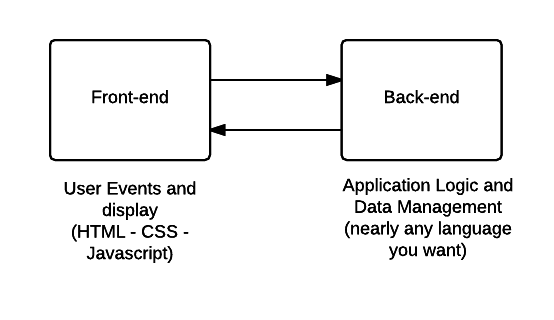

title: Introduction
output: intro.html
controls: false

--

# Introduction to Front-end Web Development

--

### Overview



--

### HTML

HTML (Hyper-Text Markup Language) allows for managing the page structure and element types.

Sample code

```
<!-- index.html -->
<!DOCTYPE html>
<html lang="en">
  <head>
    <meta charset="utf-8">
    <title>Hello World</title>
  </head>
  <body>
    <h1>Hello World</h1>
    <p>This is a web page.</p>
  </body>
</html>
```

---

### CSS

CSS (Cascading Style Sheets) allows for managing layout and styles of the HTML page.

Sample code

```css
/* styles.css */
p {
  background: orange;
  font-size: 24px;
}
p {
  background: green;
}
```

---

### Javascript

Javascript is an interpreted programming language and it is used in handling user events and manipulating the DOM.
it is generally used in:

- making requests to the server
- user input validation
- animations
- Handling user events (clicking, typing, ...etc.)

websites like gmail, soundcloud, facebook depend heavily on Javascript frameworks.

---

### technologies

CSS: SASS, LESS

Javascript: Backbone.js, Angularjs, ember.js, react.js, JQuery

Automation: Grunt, Bower, Yeoman

html,css,javascript: Bootstrap, Foundation, UIKit, Pure.css